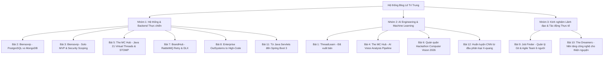

# KẾ HOẠCH NỘI DUNG BLOG KỸ THUẬT (TECHNICAL BLOG CONTENT STRATEGY)
**Tác giả**: Lê Trí Trung — Back-End Developer & AI Engineer  
**Website**: [trungle2605.vercel.app](https://trungle2605.vercel.app)  
**Mục tiêu**: Xây dựng kho bài viết kỹ thuật chuyên sâu (Engineering Deep-Dive), chứng minh năng lực thực chiến trong thiết kế hệ thống (System Design), tối ưu hóa cơ sở dữ liệu, kiến trúc microservices và triển khai AI/Machine Learning thực tế.

---

## TỔNG QUAN CHIẾN LƯỢC NỘI DUNG (CONTENT STRATEGY)

Mỗi bài viết được xây dựng theo tiêu chuẩn **Show, Don't Just Tell**:
1. **Bài toán thực tế (The Real-World Problem)**: Bắt đầu từ bài toán kinh doanh thật hoặc nút thắt cổ chai (bottleneck) kỹ thuật thật.
2. **Quyết định kiến trúc & Đánh đổi (Architectural Decisions & Trade-offs)**: So sánh các phương án (Tại sao chọn A thay vì B?).
3. **Mã nguồn & Cấu trúc thực chiến (Code Snippets & Implementation)**: Đoạn code minh họa hoặc sơ đồ luồng dữ liệu chuẩn chỉ.
4. **Kết quả đo lường (Metrics & Benchmarks)**: Đo lường bằng số liệu (Latency, Pass Rate, Throughput, Revenue).
5. **Gán link sản phẩm (Product Links), Repositories & References**: Trực tiếp dẫn link tới live demo, GitHub repo và tài liệu học thuật.

---

## DANH SÁCH 10+ BÀI VIẾT KỸ THUẬT ĐƯỢC THIẾT KẾ CHI TIẾT

---

### BÀI 1 (ĐÃ XUẤT BẢN): ThreadLearn — Dạy Model 1.5B Tham Số Sửa Lỗi Concurrency JavaScript
* **Slug**: `threadlearn-javascript-concurrency-bugs`
* **Tiêu đề Tiếng Anh**: *Teaching a 1.5B-Parameter Model to Fix JavaScript Concurrency Bugs*
* **Tiêu đề Tiếng Việt**: *Dạy một model 1.5B tham số sửa lỗi concurrency JavaScript*
* **Tags**: `AI`, `RAG`, `Fine-tuning`, `JavaScript`, `FastAPI`
* **Sản phẩm & Links**:
  * Live Demo: [threadlearn.vercel.app](https://threadlearn.vercel.app/)
  * GitHub Repo: [github.com/ThreadLearn/ThreadLearn_AI_Trainning](https://github.com/ThreadLearn/ThreadLearn_AI_Trainning)
  * Visual Demo: [github.com/ThreadLearn/ThreadLearn-AI-Visual](https://github.com/ThreadLearn/ThreadLearn-AI-Visual)
* **Điểm nhấn kỹ thuật**:
  * Fine-tune Qwen2.5-Coder-1.5B bằng QLoRA trên Kaggle 2xT4 GPUs.
  * Xây dựng pipeline RAG dựa trên BM25 và AST (esprima) trích xuất Identifier, tránh vỡ tên hàm/biến.
  * Kết quả benchmark 30 lỗi production thật: đạt 73.3% vượt GPT-3.5-turbo (65.0%).
* **Tài liệu tham khảo (References)**:
  * NodeCB Study (ASE 2017): *Understanding and Detecting Concurrency Bugs in Node.js Applications*.
  * QLoRA Paper: *Efficient Finetuning of Quantized LLMs* (Dettmers et al., NeurIPS 2023).
  * Nghiên cứu nộp tại hội nghị quốc tế ICTA 2026.

---

### BÀI 2: Biensovip — Vì sao PostgreSQL đánh bại MongoDB trong bài toán Multi-Filter Biển Số Đẹp?
* **Slug**: `biensovip-postgresql-vs-mongodb-multi-filter`
* **Tiêu đề Tiếng Anh**: *Why PostgreSQL Beat MongoDB for Complex License Plate Multi-Filter Queries: An Architectural Case Study*
* **Tiêu đề Tiếng Việt**: *Xây dựng Marketplace Biensovip: Vì sao tôi chọn PostgreSQL thay vì MongoDB cho bài toán lọc biển số phức tạp?*
* **Tags**: `.NET 8`, `PostgreSQL`, `Entity Framework Core`, `Database Indexing`, `System Design`
* **Sản phẩm & Links**:
  * Live Production: [biensovip.com](https://biensovip.com)
  * Backend Repo: [github.com/BienSoDep/biensovip-backend](https://github.com/BienSoDep/biensovip-backend)
* **Bối cảnh & Vấn đề**:
  * Ban đầu, MongoDB thường được các bạn lập trình viên chọn cho e-commerce vì tính linh hoạt của document JSON.
  * Nhưng biển số xe có logic nghiệp vụ cực kỳ khắt khe: lọc theo mã tỉnh thành, định dạng số (ngũ quý `99999`, tứ quý `8888`, sảnh tiến `56789`, lộc phát `6868`, tam hoa kép, số gánh), dải giá từ-đến, trạng thái cọc, ngày đấu giá.
* **Điểm nhấn kỹ thuật**:
  * **Composite B-Tree & Functional Indexing**: Tạo index trên các thuộc tính dẫn xuất từ chuỗi biển số (`SUBSTRING`, `REGEXP_MATCHES`).
  * **pg_trgm Extension**: Tối ưu tìm kiếm mờ (fuzzy search) và wildcard search `%43A-999%` với chỉ mục GiST/GIN, giảm thời gian truy vấn từ 350ms xuống dưới 8ms trên tập dữ liệu hàng chục nghìn biển số.
  * **Entity Framework Core 8 Clean Architecture**: 61 entities với quan hệ chặt chẽ giữa `Plate`, `Category`, `DepositOrder`, `AuditLog`.
* **Tài liệu tham khảo (References)**:
  * PostgreSQL Documentation: *Trigram Indexing with pg_trgm & GiST/GIN*.
  * Martin Fowler: *Catalog Queries and Relational vs Document Stores*.
  * Clean Architecture in ASP.NET Core: *Steve Smith (Ardalis)*.

---

### BÀI 3: Biensovip — Giao MVP Marketplace Solo trong 30 Ngày & Chiến lược Bảo mật Thực tế
* **Slug**: `biensovip-solo-mvp-30-days-security-scope`
* **Tiêu đề Tiếng Anh**: *Shipping a Production Marketplace Solo in 30 Days: Architecture, Security Scoping, and Zero Payment Gateway*
* **Tiêu đề Tiếng Việt**: *Giao MVP Marketplace Solo trong 30 ngày: Lựa chọn kiến trúc, phân định phạm vi và quyết định không tích hợp cổng thanh toán*
* **Tags**: `Freelance`, `.NET 8`, `React 19`, `Security`, `DeepSeek AI`, `VPS`
* **Sản phẩm & Links**:
  * Website: [biensovip.com](https://biensovip.com)
  * Demo Video & Dashboard: Quản trị viên trên [biensovip.com/admin](https://biensovip.com)
* **Bối cảnh & Vấn đề**:
  * Làm việc một mình (solo developer) với khách hàng trả phí, ngân sách có hạn, thời hạn bàn giao MVP là 30 ngày. Làm sao để kịp tiến độ mà hệ thống vẫn chạy ổn định trên production?
* **Điểm nhấn kỹ thuật**:
  * **Quyết định bảo mật có chủ đích (Deliberate Scope Call)**: Tại sao việc tích hợp cổng thanh toán trực tuyến là con dao hai lưỡi với sản phẩm có giá trị tài sản lớn (phí cọc hàng chục triệu đồng, rủi ro gian lận thẻ tín dụng, quy định tuân thủ PCI-DSS Level 4). Thay vào đó, thiết kế luồng xác thực tiền cọc qua mã tham chiếu ngân hàng (Bank Transfer Memo) và kiểm duyệt thủ công 2 bước.
  * **Tích hợp DeepSeek AI Assistant**: Xây dựng chatbot tư vấn biển số phong thủy và định giá tự động bằng cách inject schema database vào system prompt của DeepSeek API.
  * **Triển khai VPS từ A-Z**: Cấu hình Nginx Reverse Proxy, Docker Compose, SSL Let's Encrypt tự động gia hạn, AWS SES gửi email thông báo trạng thái đơn hàng.
* **Tài liệu tham khảo (References)**:
  * PCI Security Standards Council: *PCI DSS Quick Reference Guide*.
  * OWASP Top 10 API Security Risks: *Broken Object Level Authorization (BOLA)*.

---

### BÀI 4: The MC Hub — Kiến trúc Microservice AI Phân Tích Giọng Nói Real-time với FastAPI & Whisper
* **Slug**: `the-mc-hub-ai-speech-analysis-microservice`
* **Tiêu đề Tiếng Anh**: *Inside The MC Hub: Building a Real-Time Voice Analysis Microservice with Python FastAPI and OpenAI Whisper*
* **Tiêu đề Tiếng Việt**: *Bên trong The MC Hub: Xây dựng Microservice AI phân tích ngữ điệu, phát âm và nhịp thở của MC bằng FastAPI & Whisper*
* **Tags**: `Python`, `FastAPI`, `OpenAI Whisper`, `Audio DSP`, `AI Microservice`
* **Sản phẩm & Links**:
  * Live Web: [mc-voice-training.vercel.app](https://mc-voice-training.vercel.app/)
  * Organization Repo: [github.com/The-MC-Hub](https://github.com/The-MC-Hub)
* **Bối cảnh & Vấn đề**:
  * MC sự kiện cần luyện giọng với phản hồi tức thì. Tuy nhiên, các bài học chỉ có âm thanh mẫu tĩnh, không biết học viên nói sai ở từ nào, nhịp ngắt có quá nhanh hay ngữ điệu có đều đều gây buồn ngủ hay không.
* **Điểm nhấn kỹ thuật**:
  * **Audio Ingestion & Preprocessing**: Nhận tệp âm thanh WebM/WAV từ trình duyệt, chuyển đổi sample rate (16kHz mono) qua `ffmpeg-python`.
  * **Whisper Word-Level Timestamps**: Sử dụng Whisper để lấy mốc thời gian chính xác từng từ (start/end time), tính toán chỉ số WPM (Words Per Minute).
  * **Pitch Curve & Silence Extraction**: Sử dụng thư viện xử lý tín hiệu âm thanh (`librosa` / `parselmouth`) trích xuất đường cong F0 (tần số cơ bản) để đánh giá độ biến thiên ngữ điệu (Intonation dynamic range) và phát hiện khoảng lặng (silence segments) đo nhịp lấy hơi.
  * **Scoring Algorithm**: Thuật toán chấm điểm tổng hợp (Pronunciation Accuracy, Pace Consistency, Intonation Energy, Pause Appropriateness) phục vụ 101 bài tập và 4 khóa học.
* **Tài liệu tham khảo (References)**:
  * Radford et al. (OpenAI): *Robust Speech Recognition via Large-Scale Weak Supervision (Whisper Paper)*.
  * Boersma, P.: *Praat: doing phonetics by computer (Computer program)*.
  * Librosa: *Audio and Music Signal Analysis in Python*.

---

### BÀI 5: The MC Hub — Tối Ưu Hệ Thống Đặt Lịch & Chat Thời Gian Thực với Java 21 Virtual Threads & STOMP
* **Slug**: `the-mc-hub-high-concurrency-java21-virtual-threads`
* **Tiêu đề Tiếng Anh**: *Scaling Event Bookings & Real-Time Chat: Java 21 Virtual Threads, Spring Boot 3.3, and WebSocket/STOMP*
* **Tiêu đề Tiếng Việt**: *Xử lý đồng thời cao trong đặt lịch MC & Chat thời gian thực: Java 21 Virtual Threads, Spring Boot 3.3 và WebSocket/STOMP*
* **Tags**: `Java 21`, `Spring Boot 3.3`, `Virtual Threads`, `WebSocket`, `MongoDB Atlas`
* **Sản phẩm & Links**:
  * Backend Repo: [github.com/The-MC-Hub/mc-hub-backend](https://github.com/The-MC-Hub)
  * Live App: [mc-voice-training.vercel.app](https://mc-voice-training.vercel.app/)
* **Bối cảnh & Vấn đề**:
  * Khi nhiều khách hàng cùng truy cập đặt lịch một MC hot vào các ngày cao điểm (mùa cưới, tiệc cuối năm) và đồng thời nhắn tin hỏi giá, mô hình thread-per-request truyền thống của Tomcat nhanh chóng cạn kiệt thread pool do các tác vụ I/O blocking (chờ database MongoDB, gọi payment PayOS).
* **Điểm nhấn kỹ thuật**:
  * **Project Loom & Virtual Threads**: Cấu hình `spring.threads.virtual.enabled=true` trên Spring Boot 3.3. So sánh benchmark tải với k6 giữa Platform Threads (Tomcat truyền thống) và Virtual Threads: số lượng request đồng thời phục vụ tăng gấp 3.8 lần khi chịu tải I/O blocking nặng.
  * **WebSocket với giao thức STOMP**: Thiết kế kênh chat bảo mật với JWT handshake, định tuyến tin nhắn giữa MC và Khách hàng với độ trễ < 50ms.
  * **Optimistic Locking phòng chống Double Booking**: Sử dụng trường version trên MongoDB để đảm bảo một MC không thể bị hai khách hàng đặt cọc trùng vào một khung giờ.
* **Tài liệu tham khảo (References)**:
  * JEP 444: *Virtual Threads (OpenJDK Project Loom)*.
  * Spring Framework Documentation: *WebSocket & STOMP Messaging Architecture*.

---

### BÀI 6: Quán Quân Hackathon Computer Vision 2026 — Đánh Đổi Accuracy vs Inference Latency
* **Slug**: `winner-hackathon-computer-vision-2026`
* **Tiêu đề Tiếng Anh**: *Winning the 2026 Computer Vision Hackathon: Balancing Model Accuracy and Inference Latency Under 48-Hour Pressure*
* **Tiêu đề Tiếng Việt**: *Hành trình đoạt giải Quán quân Hackathon Computer Vision 2026: Chiến lược đánh đổi độ chính xác và độ trễ trong 48 giờ*
* **Tags**: `Computer Vision`, `AI Hackathon`, `Model Optimization`, `PyTorch`, `ONNX`
* **Sản phẩm & Links**:
  * Bằng khen & Cúp Quán quân: FPT Education (06/08/2026)
  * Trưng bày chứng nhận: [trungle2605.vercel.app/certificates](https://trungle2605.vercel.app/certificates)
* **Bối cảnh & Vấn đề**:
  * Trong một cuộc thi Hackathon AI kéo dài 48 tiếng, hầu hết các đội đều thất bại vì cố gắng nhồi nhét mô hình khổng lồ dẫn đến timeout khi ban giám khảo chấm bài, hoặc overfit dữ liệu ban tổ chức cung cấp.
* **Điểm nhấn kỹ thuật**:
  * **Chiến thuật xử lý dữ liệu thần tốc (Data Triage)**: Phân tích phân bố nhãn (EDA), phát hiện nhiễu ảnh và áp dụng kỹ thuật Data Augmentation chọn lọc (Mosaic, Albumentations) giúp tăng khả năng tổng quát hóa trên dữ liệu lạ.
  * **Lựa chọn Backbone thông minh**: Tại sao chọn kiến trúc nhẹ nhưng giàu đặc trưng thay vì mô hình cồng kềnh.
  * **Quantization & ONNX Runtime Export**: Chuyển đổi mô hình PyTorch sang ONNX FP16/INT8, giảm dung lượng mô hình 60% và tăng tốc độ suy luận (inference speed) lên 2.5x mà độ chính xác mAP chỉ giảm < 0.8%.
* **Tài liệu tham khảo (References)**:
  * ONNX Runtime Documentation: *Performance Tuning and Quantization*.
  * Papers With Code: *Real-time Computer Vision Benchmarks*.

---

### BÀI 7: BrandHub — Kiến Trúc Chịu Lỗi Xuất Bản Đa Mạng Xã Hội với RabbitMQ và Spring Cloud
* **Slug**: `brandhub-rabbitmq-retry-dead-letter-queue`
* **Tiêu đề Tiếng Anh**: *Publishing to 5 Social Networks Concurrently: Implementing Resilient Retry and Dead-Letter Exchanges with RabbitMQ*
* **Tiêu đề Tiếng Việt**: *Đăng nội dung đồng thời lên 5 mạng xã hội: Thiết kế hệ thống chịu lỗi với RabbitMQ Retry & Dead Letter Queue*
* **Tags**: `Microservices`, `Spring Boot`, `RabbitMQ`, `Event-Driven`, `Resilience`
* **Sản phẩm & Links**:
  * Organization Repo: [github.com/BrandHubOrganization](https://github.com/BrandHubOrganization)
* **Bối cảnh & Vấn đề**:
  * Khi một agency đăng bài lên đồng thời Facebook, Instagram, TikTok, Threads và Zalo, các mạng xã hội có tốc độ phản hồi và giới hạn API (rate limits) rất khác nhau. Nếu một mạng bị nghẽn (HTTP 429 hoặc 504), hệ thống không được phép làm treo toàn bộ tiến trình xuất bản.
* **Điểm nhấn kỹ thuật**:
  * **Tách rời luồng xử lý (Decoupling)**: API Gateway (Spring Cloud Gateway WebFlux) nhận lệnh đăng và trả kết quả `202 Accepted` ngay lập tức, đẩy message vào RabbitMQ Exchange.
  * **Exponential Backoff & Dead Letter Exchange (DLX)**: Cơ chế thử lại lũy tiến (thử lại sau 5s, 30s, 2 phút, 10 phút). Nếu sau 5 lần vẫn thất bại, tin nhắn được định tuyến vào Dead Letter Queue để admin xem xét nguyên nhân (ví dụ: token tài khoản hết hạn) và kích hoạt gửi lại bằng 1 nút bấm.
  * **Idempotent Consumer**: Đảm bảo không bao giờ đăng bài trùng lặp lên mạng xã hội của khách hàng dù có sự cố mạng.
* **Tài liệu tham khảo (References)**:
  * Enterprise Integration Patterns: *Guaranteed Delivery and Dead Letter Channel (Hohpe & Woolf)*.
  * RabbitMQ Official Guides: *Reliability, Dead Lettering, and Publisher Confirms*.

---

### BÀI 8: Thực Tập Tại FPT Software — Góc Nhìn Của Kỹ Sư Backend Về Low-Code Enterprise
* **Slug**: `fpt-software-internship-outsystems-backend-perspective`
* **Tiêu đề Tiếng Anh**: *From Spring Boot to OutSystems: What a Backend Engineer Learned in an Enterprise Low-Code Team*
* **Tiêu đề Tiếng Việt**: *Từ Spring Boot đến OutSystems: Kỹ sư Backend học được gì khi thực tập tại FPT Software?*
* **Tags**: `FPT Software`, `OutSystems`, `Enterprise Software`, `Agile`, `Software Architecture`
* **Sản phẩm & Links**:
  * Demo Ứng dụng: [Book Shop OutSystems Cloud](https://personal-fu4tft5e.outsystemscloud.com/BookShopCore/BookStore)
  * Repo Demo: [github.com/trung2605/Book-Shop-Outsystems-Public](https://github.com/trung2605/Book-Shop-Outsystems-Public)
* **Bối cảnh & Vấn đề**:
  * Nhiều lập trình viên thường đánh giá thấp Low-Code và nghĩ rằng nó "không phải code thật". Tuy nhiên, tại các tập đoàn lớn như FPT Software, OutSystems được dùng để phân phối các hệ thống nghiệp vụ triệu đô cho các ngân hàng và tập đoàn đa quốc gia.
* **Điểm nhấn kỹ thuật**:
  * **Kiến trúc 4 tầng trong OutSystems (Architecture Canvas)**: Foundation, Core, Business Logic và End-User Layer tương đồng với Clean Architecture như thế nào.
  * **Tối ưu hóa hiệu năng visual queries**: Tránh N+1 query và tối ưu hóa Aggregate trong database quan hệ khi kéo thả logic.
  * **Quy trình Agile & Code Review chuẩn doanh nghiệp**: Cách quản lý phiên bản, merge conflict giữa các developer trong môi trường visual development.
* **Tài liệu tham khảo (References)**:
  * OutSystems Architecture Canvas: *Designing Modular Applications*.
  * Gartner Research: *Enterprise Low-Code Application Platforms (LCAP)*.

---

### BÀI 9: Job Finder — Quản Lý Đội Ngũ 6 Lập Trình Viên: Chiến Lược Git & Luồng Xác Thực JWT
* **Slug**: `job-finder-agile-git-branching-jwt-auth`
* **Tiêu đề Tiếng Anh**: *Leading a 6-Developer Agile Team: Git Branching Strategy, CI/CD, and JWT Authentication in Spring Boot*
* **Tiêu đề Tiếng Việt**: *Dẫn dắt team Agile 6 người trong dự án Job Finder: Chiến lược phân nhánh Git, CI/CD và xác thực JWT kép*
* **Tags**: `Java Spring Boot`, `Git Flow`, `Team Leadership`, `Agile`, `JWT Auth`
* **Sản phẩm & Links**:
  * Live Web: [fe-jobfinder.vercel.app](https://fe-jobfinder.vercel.app/)
  * GitHub Repo: [github.com/SWPGr](https://github.com/SWPGr)
* **Bối cảnh & Vấn đề**:
  * Đồ án lớn kéo dài 4 tháng với 6 thành viên (3 frontend, 2 backend, 1 QA). Làm thế nào để phối hợp mượt mà, không giẫm chân lên code của nhau, và duy trì hệ thống API ổn định suốt 16 tuần?
* **Điểm nhấn kỹ thuật**:
  * **Git Flow biến thể (Trunk-based with Short-lived Feature Branches)**: Quy tắc Pull Request, bắt buộc review chéo, và quy ước commit (Conventional Commits) giúp loại bỏ xung đột code phức tạp.
  * **Cơ chế xác thực Access & Refresh Token kép**: Access Token tồn tại trong thời gian ngắn (15 phút), Refresh Token bảo mật trong HttpOnly Cookie với cơ chế Refresh Token Rotation chống đánh cắp phiên.
  * **Tự động hóa tài liệu với Swagger / OpenAPI 3**: Frontend dev không cần hỏi backend "API này trả về gì" vì schema luôn tự cập nhật khi compile Spring Boot.
* **Tài liệu tham khảo (References)**:
  * RFC 7519: *JSON Web Token (JWT)*.
  * Martin Fowler: *Branching Patterns in Git*.

---

### BÀI 10: The Dreamers — Ứng Dụng Công Nghệ Cho Tổ Chức Thiện Nguyện Sinh Viên
* **Slug**: `the-dreamers-tech-for-social-impact`
* **Tiêu đề Tiếng Anh**: *Building Software for Social Impact: How We Founded The Dreamers and Built Tech for Transparency*
* **Tiêu đề Tiếng Việt**: *Công nghệ vì cộng đồng: Hành trình sáng lập The Dreamers và xây dựng nền tảng minh bạch hóa thiện nguyện*
* **Tags**: `The Dreamers`, `Spring Boot`, `Leadership`, `Social Impact`, `Transparency`
* **Sản phẩm & Links**:
  * Backend Repo: [github.com/trung2605/the_dreamers_backend](https://github.com/trung2605/the_dreamers_backend)
  * Hoạt động tổ chức: [trungle2605.vercel.app/activities](https://trungle2605.vercel.app/activities)
* **Bối cảnh & Vấn đề**:
  * Thành lập tổ chức thiện nguyện sinh viên lúc 19 tuổi, quy tụ 30 thành viên. Vấn đề lớn nhất của các tổ chức từ thiện là **sự minh bạch trong tài chính và quản lý hoạt động tình nguyện viên**.
* **Điểm nhấn kỹ thuật & Xã hội**:
  * **Hệ thống theo dõi sao kê & quản lý chiến dịch**: Xây dựng backend Java Spring Boot ghi log mọi khoản thu chi, phân loại chi phí cho các sự kiện lớn (*Tết Hy Vọng*, *Vòng Vào Mộng Mơ*, *Dream High*).
  * **Bài học về lãnh đạo**: Cách cân bằng giữa học tập trên trường, đi thực tập tại FPT Software, làm freelance và điều hành 30 con người trong một tổ chức phi lợi nhuận.
* **Tài liệu tham khảo (References)**:
  * Principles of Transparent Nonprofit Governance.

---

### BÀI 11 (BỔ SUNG): Tiến Trình Tiến Hóa Backend: Từ Java Servlets Cổ Điển Đến Spring Boot 3 & Clean Architecture
* **Slug**: `from-java-servlets-to-spring-boot-3`
* **Tiêu đề Tiếng Anh**: *My Backend Journey: From Java Servlets and Raw JDBC to Spring Boot 3 and Clean Architecture*
* **Tiêu đề Tiếng Việt**: *Hành trình tiến hóa của một Backend Dev: Từ Java Servlets, JSP đến Spring Boot 3 và Clean Architecture*
* **Tags**: `Java`, `Spring Boot 3`, `Servlets`, `Refactoring`, `Architecture Evolution`
* **Sản phẩm & Links**:
  * Dự án Dola Bakery: [github.com/trung2605/BakeryManagement](https://github.com/trung2605/BakeryManagement)
  * Demo: [themes.sapo.vn/demo/dola-bakery](https://themes.sapo.vn/demo/dola-bakery)
* **Điểm nhấn kỹ thuật**:
  * **Tại sao hiểu sâu về Servlets là lợi thế lớn**: Hiểu rõ vòng đời `HttpServletRequest`, `HttpServletResponse`, `Filter` giúp việc học `DispatcherServlet` và Security Filter Chain trong Spring Boot trở nên cực kỳ trực quan.
  * **Hành trình tái cấu trúc**: Từ JDBC Template viết SQL thô sang Hibernate/JPA, từ Session Stateful sang Stateless RESTful API.

---

### BÀI 12 (BỔ SUNG): Huấn Luyện CNN Từ Đầu Phân Loại X-quang Phổi: Xử Lý Dữ Liệu Lệch 74.3%
* **Slug**: `training-cnn-from-scratch-chest-xray-pneumonia`
* **Tiêu đề Tiếng Anh**: *Training a CNN from Scratch on 5,856 Chest X-Rays: Handling 74.3% Class Imbalance Without Transfer Learning*
* **Tiêu đề Tiếng Việt**: *Huấn luyện mạng CNN từ đầu trên 5.856 ảnh X-quang phổi: Xử lý bài toán lệch lớp 74.3% không dùng Transfer Learning*
* **Tags**: `Deep Learning`, `TensorFlow`, `CNN`, `Medical AI`, `EDA`
* **Sản phẩm & Links**:
  * Chi tiết dự án trên trang portfolio: [trungle2605.vercel.app/projects](https://trungle2605.vercel.app/projects)
* **Điểm nhấn kỹ thuật**:
  * Thử thách huấn luyện CNN từ đầu trong giới hạn 3 giờ không dùng pre-trained weights.
  * Kỹ thuật xử lý mất cân bằng lớp nghiêm trọng (74.3% Pneumonia): Class Weights, Focal Loss, và kỹ thuật tăng cường ảnh y tế (Affine, Random Contrast, Gaussian Blur).

---

## LỘ TRÌNH TRIỂN KHAI THEO TỪNG GIAI ĐOẠN (ROADMAP)

| Giai đoạn | Mục tiêu | Bài viết ưu tiên | Công việc cụ thể |
|---|---|---|---|
| **Wave 1 (Tuần 1 - 2)** | Khẳng định vị thế Full-Stack & AI Engineer hàng đầu | **Bài 2 (Biensovip PostgreSQL)** & **Bài 4 (The MC Hub AI Voice)** | Viết hoàn chỉnh markdown bài 2 & 4, bổ sung vào `data.js` và locale `en.json`/`vi.json`. |
| **Wave 2 (Tuần 3 - 4)** | Chứng minh thành tích nổi bật & Kiến trúc phân tán | **Bài 6 (Hackathon CV Winner)** & **Bài 7 (BrandHub RabbitMQ)** | Soạn thảo chi tiết về chiến thuật hackathon và thiết kế hàng đợi tin nhắn. |
| **Wave 3 (Tuần 5 - 6)** | Khẳng định tư duy sản phẩm thực tế & Năng lực lãnh đạo | **Bài 3 (Biensovip Solo MVP)** & **Bài 5 (Java 21 Virtual Threads)** | Tập trung vào số liệu đo lường benchmark và quy trình bàn giao khách hàng. |
| **Wave 4 (Tuần 7 - 8)** | Chia sẻ góc nhìn đa chiều & Kinh nghiệm thực tập | **Bài 8 (FPT Software OutSystems)**, **Bài 9 (Job Finder)**, **Bài 10 (The Dreamers)** | Mở rộng góc nhìn văn hóa làm việc, kỹ năng mềm và tác động cộng đồng. |

---

## HƯỚNG DẪN TÍCH HỢP VÀO WEBSITE CỦA BẠN

Khi chuẩn bị đưa một bài viết mới vào website:
1. Thêm metadata và nội dung gốc tiếng Việt vào mảng `posts` trong file [`src/data.js`](file:///d:/ProjectCode/my-website/src/data.js).
2. Thêm bản dịch tiếng Anh vào `postItems` trong [`src/locales/en.json`](file:///d:/ProjectCode/my-website/src/locales/en.json).
3. Thêm bản dịch tiếng Việt vào `postItems` trong [`src/locales/vi.json`](file:///d:/ProjectCode/my-website/src/locales/vi.json).
4. Kiểm tra trang danh sách `/blog` và trang chi tiết `/blog/:slug`. Giao diện sẽ tự động render các thẻ tags, thời gian đọc, khối highlight code và ảnh minh họa mượt mà.
